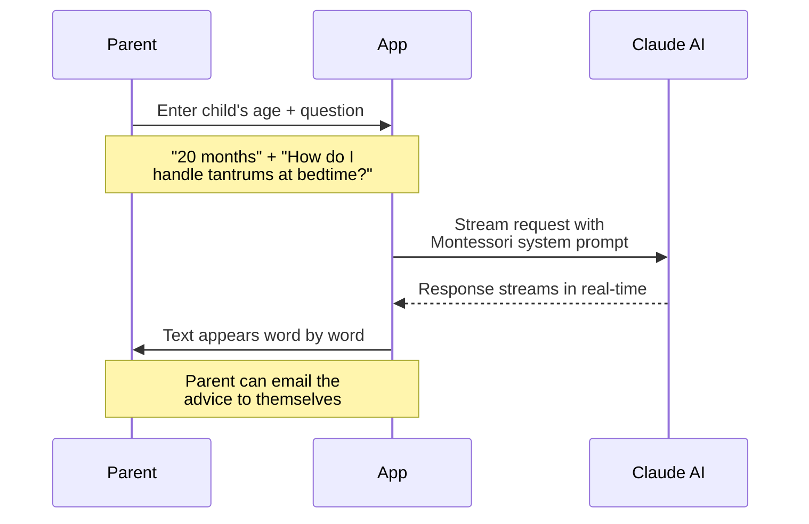
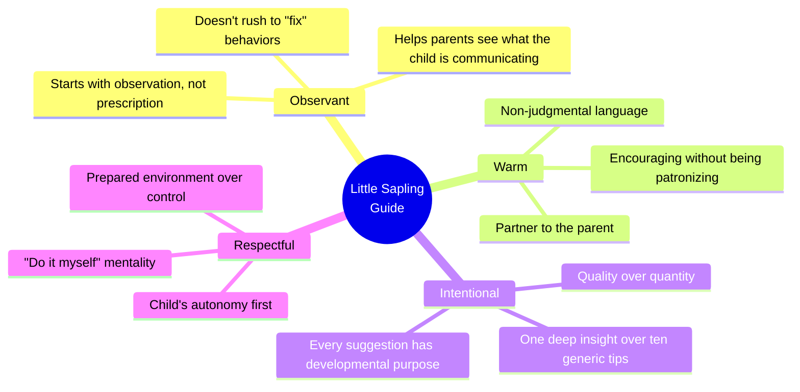
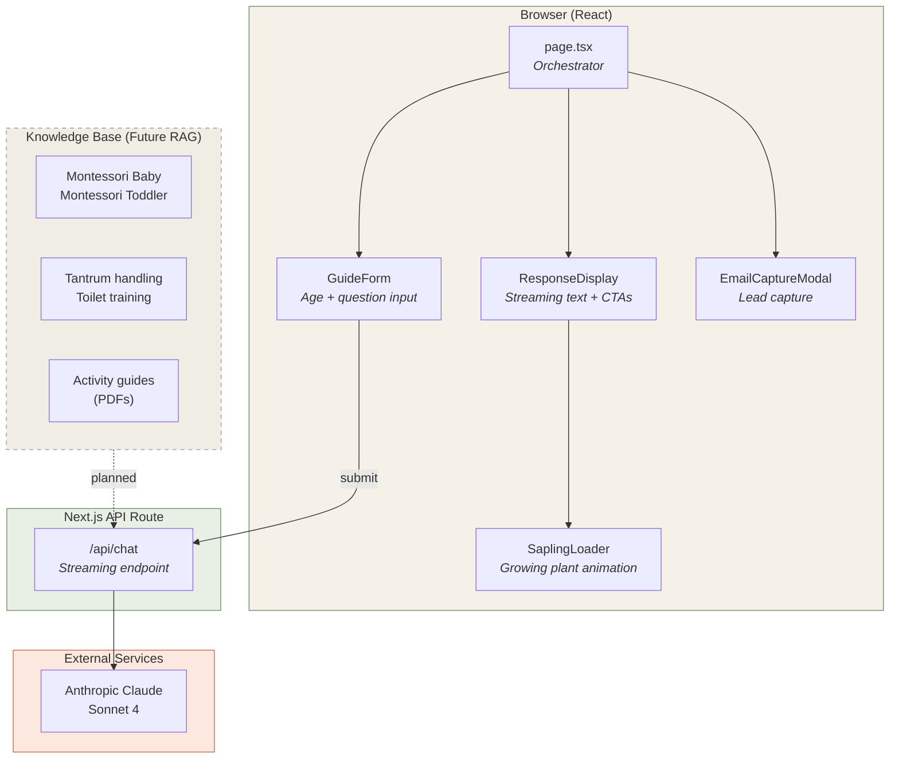
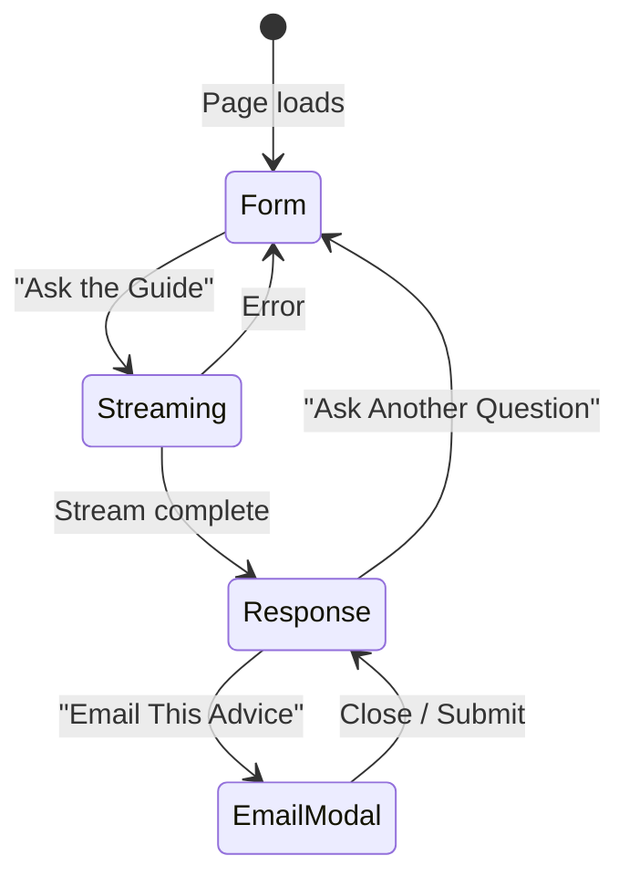
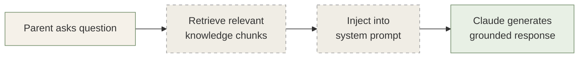
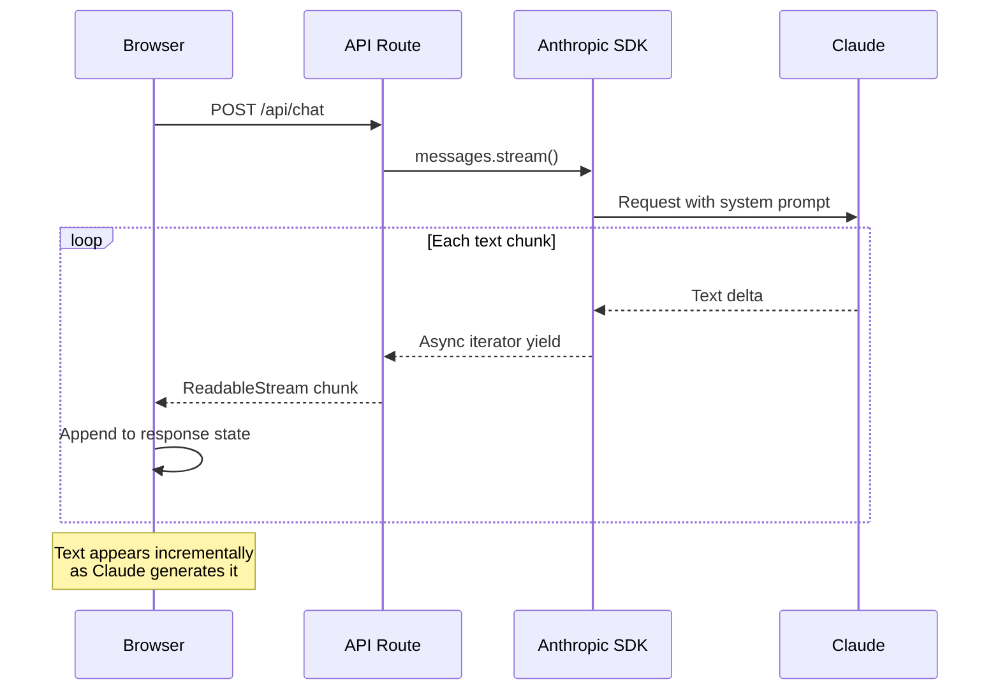

# Little Sapling Studio Guide

**An AI-powered Montessori mentor that helps parents create prepared environments for their children.**

A parent types "My 18-month-old throws food at every meal" and instead of getting a generic listicle, they get a calm, observant response about trajectory schemas and how to redirect that impulse with a basket of soft wool balls in a designated movement area. That's this app.

---

## The Idea

[Little Sapling Studio](https://www.littlesaplingstudio.com) makes Montessori-aligned wooden furniture and tools for kids. But the real product isn't the furniture -- it's the philosophy behind it. Parents don't just need a weaning table; they need to understand *why* a weaning table matters and *when* their child is ready for one.

So we built a digital Montessori guide. You tell it your child's age and ask a question -- anything from "how do I set up a prepared environment?" to "why does my toddler keep climbing on everything?" -- and it responds like a seasoned Montessori teacher would: observant, warm, never rushed, never preachy.

When the advice naturally involves a physical tool (a Pikler triangle, a floor bed, child-sized utensils), the guide mentions it the way a mentor would -- as a bridge to independence, not a sales pitch.

## How It Works



The response streams in real-time -- text appears word by word as Claude generates it, so there's no waiting for a full response before you can start reading. Important when you're a parent asking a question with one hand while holding a toddler with the other.

## The AI Persona

This isn't a generic chatbot. The system prompt is carefully crafted to produce a specific voice:



**Instead of:** "Here are 5 tips to stop your toddler from throwing things."

**The guide says:** "When we see a toddler throwing, we are often seeing an exploration of *trajectory* -- the way objects move through space. Instead of stopping the impulse, let's look at the prepared environment. Can we provide a small basket of soft wool balls in a designated movement area where this need can be safely met?"

## Architecture



The app is intentionally simple -- a single page with a form, a streaming response display, and an email capture modal. No routing, no auth, no database. Just a parent, a question, and a thoughtful answer.

## User Flow



## The Knowledge Base

The `/knowledge` directory contains Montessori reference material ready for RAG (Retrieval-Augmented Generation) integration:

| File | Content | Age Range |
|------|---------|-----------|
| `The_Montessori_Baby.txt` | Infant development, sensory foundations, movement | 0-12 months |
| `The_Montessori_Toddler.txt` | Independence, practical life, language explosion | 12-36 months |
| `The_Montessori_Child.md` | Reasoning mind, social orientation, moral development | 3-12 years |
| `dealing with tantrums.txt` | Proactive + reactive strategies, calm-down techniques | 1-5 years |
| `toilet_training.txt` | Child-led approach, environment setup, handling accidents | 1-3 years |
| Activity guide PDFs | Age-appropriate activities organized by interest | 0-12 years |

**Current state:** Claude responds using its built-in knowledge + the system prompt persona. The knowledge files are staged for a future RAG pipeline that would retrieve relevant passages and inject them as context, grounding responses in specific Montessori literature.



*Dashed = planned, not yet implemented*

## Tech Stack

| Layer | Tech | Why |
|-------|------|-----|
| Framework | **Next.js 14** (App Router) | Streaming API routes + React SSR |
| Styling | **Tailwind CSS** | Custom earthy color palette, component classes |
| AI | **Anthropic Claude Sonnet 4** | Streaming responses, strong at nuanced personas |
| Fonts | **Lora** (serif) + **Open Sans** (sans) | Warm authority + clean readability |
| Hosting | **Vercel** | Zero-config Next.js deployment |
| Language | **TypeScript** | Full-stack type safety |

## How It Was Built

Built entirely with [Claude Code](https://docs.anthropic.com/en/docs/claude-code), Anthropic's CLI agent for software development. The process:

1. **Wrote the PRD and brand guidelines** -- defined the persona, color palette, typography, and the "Provider of the Soil" metaphor upfront
2. **Crafted the system prompt separately** -- iterated on the AI persona in `SYSTEM_PROMPT.md` until the tone felt right (warm but not saccharine, authoritative but not preachy)
3. **Fed everything to Claude Code** -- the agent scaffolded the Next.js project, built the streaming chat API, and styled the components to match the brand identity
4. **Curated the knowledge base** -- assembled Montessori reference materials for future RAG integration
5. **Deployed to Vercel** -- straight from the CLI

The system prompt was the hardest part. Getting an AI to sound like a Montessori teacher -- calm, observant, never rushing to fix -- required specific anti-patterns ("don't say 'Here are some tips'", "don't start with 'As an AI'") and positive examples of the voice we wanted.

## Design Details

The visual identity matches the brand philosophy -- grounded, organic, intentional:

| Element | Choice | Reasoning |
|---------|--------|-----------|
| **Primary color** | Sage `#728C69` | Calming, natural, plant-based |
| **Background** | Sand `#F5F1E9` | Soft, recalls earth and natural materials |
| **Accent** | Terracotta `#C06C4C` | Warm, recalls Montessori classroom pottery |
| **Text** | Forest `#2D3B2D` | Deep green instead of harsh black |
| **Header font** | Lora (serif) | Literary warmth and authority |
| **Body font** | Open Sans | Clean, accessible, modern |
| **Loading animation** | Growing sapling | Brand metaphor in motion |

The loading animation is a small sapling growing in a terracotta pot -- leaves sway gently while Claude thinks. It matches the brand better than a spinner and sets the right emotional tone (patience, growth, natural pace).

## Project Structure

```
montessori_advice/
├── app/
│   ├── page.tsx                  # Main page - form + response orchestrator
│   ├── layout.tsx                # Root layout, Lora + Open Sans fonts
│   ├── globals.css               # Tailwind + custom component classes
│   └── api/
│       └── chat/route.ts         # Claude streaming endpoint
├── components/
│   ├── Header.tsx                # SVG sapling logo + brand name
│   ├── GuideForm.tsx             # Age + question form with examples
│   ├── ResponseDisplay.tsx       # Streaming response + action buttons
│   ├── SaplingLoader.tsx         # Animated growing sapling
│   └── EmailCaptureModal.tsx     # Email lead capture modal
├── knowledge/                    # Montessori reference material (future RAG)
│   ├── The_Montessori_Baby.txt
│   ├── The_Montessori_Toddler.txt
│   ├── The_Montessori_Child.md
│   ├── dealing with tantrums.txt
│   ├── toilet_training.txt
│   └── *.pdf                     # Activity guides
├── SYSTEM_PROMPT.md              # AI persona definition
├── PRD.md                        # Product requirements
├── BRAND_GUIDELINES.md           # Visual identity guide
└── package.json
```

## Getting Started

### Prerequisites

You need one API key:
- [Anthropic](https://console.anthropic.com/) -- for the Claude-powered guide

The app includes a mock response mode if no key is configured, so you can explore the UI without credentials.

### Setup

```bash
# Clone and install
git clone <repo-url>
cd montessori_advice
npm install

# Configure environment
cp .env.example .env
# Edit .env with your API key:
#   ANTHROPIC_API_KEY=sk-ant-...

# Run locally
npm run dev
```

Open [http://localhost:3000](http://localhost:3000) and ask the guide a question.

### Environment Variables

| Variable | Required | Description |
|----------|----------|-------------|
| `ANTHROPIC_API_KEY` | No* | Claude API key for the Montessori guide |

*Falls back to a mock response if not set -- useful for UI development.

## Streaming Under the Hood

For the curious -- the streaming implementation uses the Anthropic SDK's `.stream()` method, wrapped in a Web `ReadableStream` that the client consumes with `response.body.getReader()`:



No WebSockets, no polling -- just a standard HTTP stream. The browser reads chunks as they arrive and appends them to React state, so the text grows on screen in real time.

## What's Next

- **RAG integration** -- wire the knowledge base into the API route so responses are grounded in specific Montessori literature
- **Email delivery** -- connect the email capture modal to Resend or Mailchimp to actually send advice to inboxes
- **Product catalog** -- maintain a structured product database so the guide can link directly to relevant items
- **Multi-turn conversations** -- maintain chat history for follow-up questions within a session

## License

MIT
